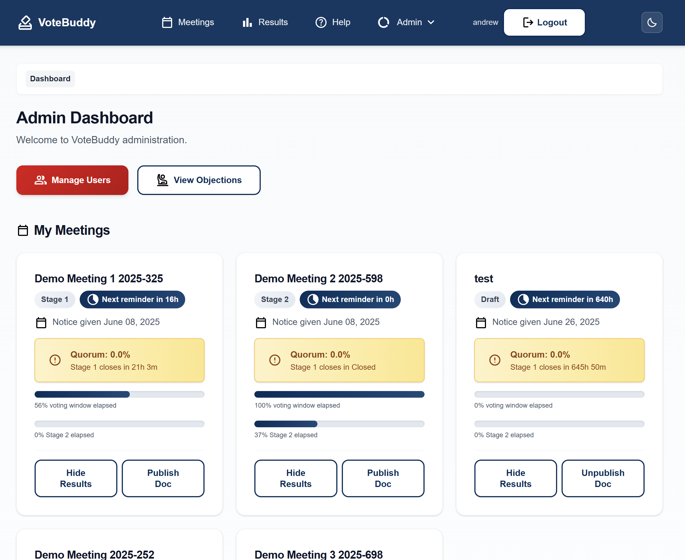
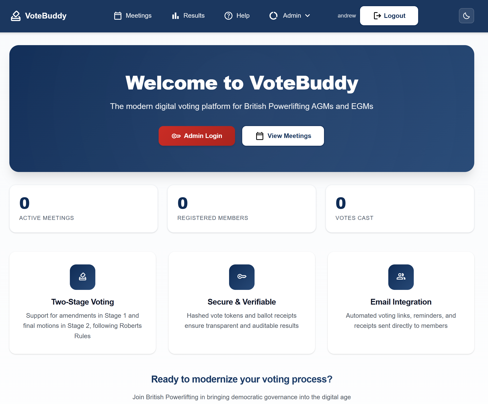
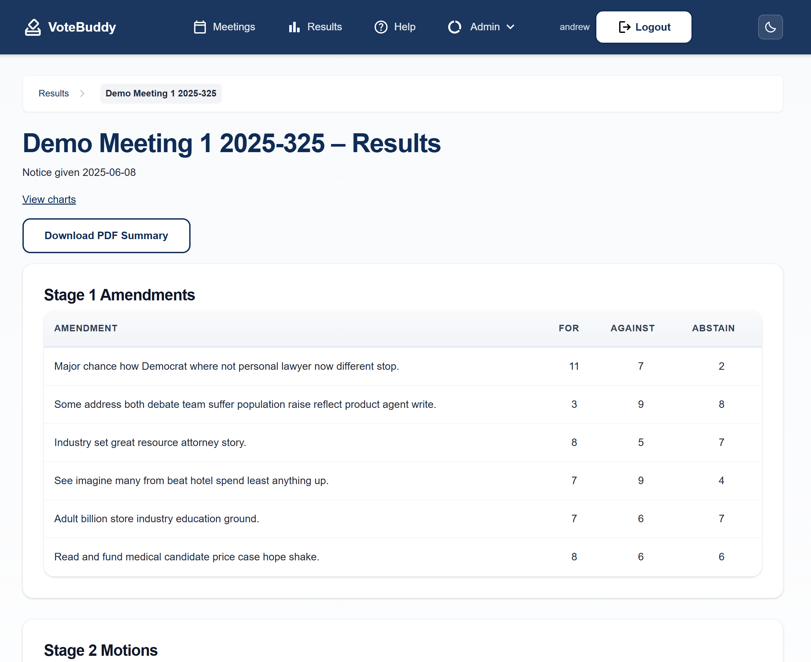

# VoteBuddy (Free and Open source AGM and EGM software for membership organisations)

VoteBuddy by [Scorchsoft](https://www.scorchsoft.com) is an Open Source web application that membership organisations can run online voting for two stage electronic ballots at AGMs and EGMs.

It supports two stage voting on amendments and final motions, sends unique voting links by email and produces auditable results.

VoteBuddy aims to apply principles from UK Parliamentary Proceedure as well as "Roberts Rules" around governance and effective meetings, to make an online ballot format that is robust and but simple enough to understand as to be inclusive.

## Features

- Flask 3 with SQLAlchemy ORM
- PostgreSQL database managed via Alembic migrations
- Dockerised development stack with Gunicorn
- Modular blueprints for auth, meetings, voting, admin and RO dashboards
- Models for meetings, members, motions, amendments, vote tokens, votes and
  run-offs with role/permission support
- Hashed vote tokens and ballot receipts for verifiable results
- Automated run-off ballots with Stage 1 extensions on ties
- Email reminders and token resends scheduled via APScheduler
- iCalendar downloads for Stage 1 and Stage 2 voting windows
- Results exports to CSV and DOCX plus audit logs
- Clone meetings to duplicate motions and amendments
- Optional unsubscribe tokens for members
- Built in Python (Flask)

## Screenshots

The following images show the main dashboard and help section in action.







## Development setup

1. Copy `.env.example` to `.env` and review the values.
   The defaults include options for email reminders and run-off timing such as
   `RUNOFF_EXTENSION_MINUTES`, `REMINDER_HOURS_BEFORE_CLOSE`,
   `REMINDER_COOLDOWN_HOURS`, `REMINDER_TEMPLATE`, `TIE_BREAK_DECISIONS` and
   `MAIL_USE_TLS`. These can later be changed in the Settings UI.
2. Install the Python packages:

```bash
pip install -r requirements.txt
```
3. Build and start the containers:

```bash
docker-compose up --build
```

Note that you don't have to run this with Docker. The app will also run locally if you have Python, Node and PostgreSQL installed.

### Running without Docker

1. Install PostgreSQL and create a database and user (example shown for Linux):

```bash
sudo -u postgres createuser -P vote_buddy
sudo -u postgres createdb -O vote_buddy vote_buddy
```

2. Edit your copied `.env` and point `DATABASE_URL` at the new user:

```env
DATABASE_URL=postgresql+psycopg2://vote_buddy:<password>@localhost:5432/vote_buddy
```

3. Apply the migrations locally:

```bash
flask db upgrade
```

From here you can continue with the remaining steps such as building the CSS and creating an admin account.

4. Install Node dependencies and compile the Tailwind CSS:

```bash
npm install
npm run build:css
```
Running the build now uses a local copy of htmx rather than fetching it from the
internet.

5. Create an initial admin user:

```bash
flask --app app create-admin
```

The `web` service runs migrations on start and exposes the app at `http://localhost:8000`.

To run the development server directly on your machine, install the requirements and execute:

```bash
python -m flask --app app run
```

### Generating demo data

You can seed a fresh development database with example meetings and members using the
`generate-fake-data` CLI command:

```bash
python -m flask --app app generate-fake-data
```

This creates demo coordinator and returning officer accounts and inserts a sample meeting with motions,
amendments and 30 random members. **Run it only on a local database** as it may conflict with real
data and could trigger emails if your mail settings are active.

### Running tests

Install the dependencies and execute:

```bash
pytest -q
```

### Security testing

Run the automated OWASP ZAP baseline scan against the local server:

```bash
scripts/zap_baseline.py
```

## Repository layout

```
app/            Flask application modules and templates
assets/         Branding assets and uploaded files
migrations/     Alembic migration scripts
tests/          Pytest unit tests
Dockerfile      Container image definition
docker-entrypoint.sh  Entrypoint used in the container
config.py       Application configuration classes
docs/           Project documentation
package.json, tailwind.config.cjs  Front-end build configuration
requirements.txt    Python dependencies
wsgi.py         App entry for Gunicorn
```

### Public API

Token-authenticated endpoints provide read-only access to meeting results.
Generate a token in the admin dashboard then query using the `Authorization`
header:

```bash
curl -H "Authorization: Bearer <token>" https://example.com/api/meetings
```

See the [API Docs](/api/docs) page for full details.

### Documentation

The `docs` directory contains background and design material:

- **prd.md** – Product Requirements Document describing the MVP goals, system architecture and work plan.
- **ui-ux-design-guidance.md** – Guidance on branding, layout and component conventions for building a consistent user experience.
- **original-british-powerlifting-voting-process-motion.md** – The full text of the motion modernising British Powerlifting's voting procedure which this app implements.
- **template-motion.md** - A more readily adoptable motion template that membership organisations can revise and adopt to make their Articles support the VoteBuddy process.
- **full-database-structure.md** – Quick reference describing all database tables and columns.
- **app-settings-guidance.md** – When to store global values in the `app_settings` table.
- **member-import.md** – Steps and CSV format for uploading members and issuing tokens.
- **unit-test-strategy.md** – Fixtures and patterns for the tests under `tests/`.

Refer to these files for detail on features, design and governance context.

## Contributing

Pull requests are welcome. Please include updates to migrations or documentation where relevant.
