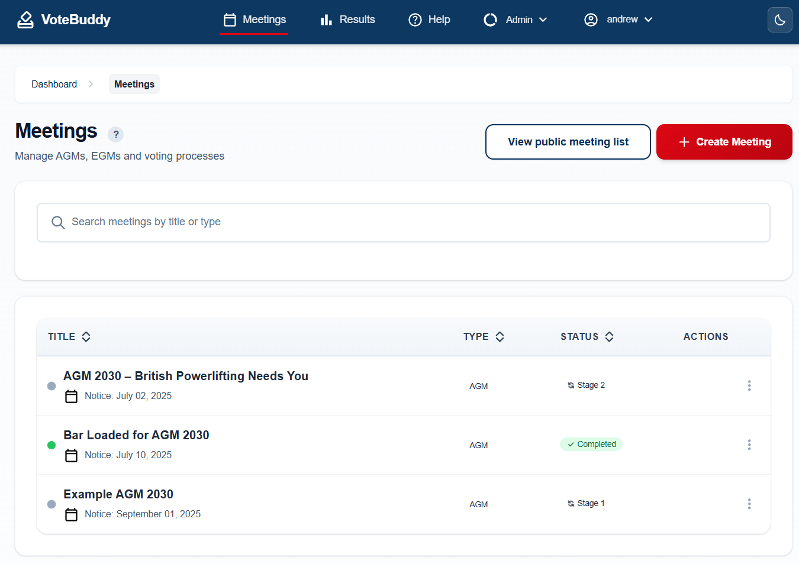

# VoteBuddy Screenshots

This page showcases the user interface and features of VoteBuddy through comprehensive screenshots. All images are from version 0.4 of the application.

## Table of Contents
- [Authentication](#authentication)
- [Home & Public Pages](#home--public-pages)
- [Admin Dashboard & Management](#admin-dashboard--management)
- [Meeting Management](#meeting-management)
- [Motion & Amendment Management](#motion--amendment-management)
- [Comments System](#comments-system)
- [Voting Interface](#voting-interface)
- [Email Templates](#email-templates)
- [Results & Charts](#results--charts)
- [Settings & Configuration](#settings--configuration)
- [Returning Officer Dashboard](#returning-officer-dashboard)
- [Help System](#help-system)

---

## Authentication

### Login Page

*Clean and simple login interface for administrators, coordinators, and returning officers*

---

## Home & Public Pages

### Home Page

*Main landing page showing upcoming meetings and key information for members*

### Public Meetings List

*Public view of all available meetings that members can access*

### Public Meeting Details

*Detailed public view of a specific meeting with motions and voting information*

---

## Admin Dashboard & Management

### Admin Dashboard

*Central hub for administrators with overview of meetings, motions, and system status*

### User Management

*Comprehensive user administration interface for managing member accounts and permissions*

---

## Meeting Management

### Create Meeting

*Meeting creation form with all necessary fields for setting up new meetings*

### View All Meetings

*Overview of all meetings in the system with status indicators and management options*

### Meeting Overview

*Detailed meeting dashboard showing timeline, statistics, and management options*

---

## Motion & Amendment Management

### Create Motion

*Motion creation interface with rich text editor and categorization options*

### View All Motions

*Comprehensive list of all motions with status indicators and batch management options*

---

## Comments System

### Motion Comments

*Interactive commenting system for motions allowing member discussion and feedback*

### Amendment Comments

*Dedicated commenting interface for amendments with threading and moderation*

---

## Voting Interface

### Motion and Amendment Review

*Comprehensive voting interface showing motions and amendments side-by-side for informed decision making*

---

## Email Templates

### Vote Invitation Email

*Professional email template inviting members to participate in voting*

### View Motions Email

*Email template showing members the available motions for review*

### View Amendments Email

*Email template displaying amendments to members for consideration*

### Submit Motions Email

*Email template encouraging member participation through motion submissions*

---

## Results & Charts

### Public Results Charts

*Interactive charts and visualizations showing voting results in an accessible format*

### Public Results Table

*Detailed tabular view of voting results with comprehensive breakdown by motion*

---

## Settings & Configuration

### Application Settings

*System-wide configuration interface for customizing VoteBuddy behavior and branding*

---

## Returning Officer Dashboard

### Returning Officer Dashboard

*Specialized dashboard for returning officers to monitor and manage the voting process*

---

## Help System

### Help Documentation

*Comprehensive help system with detailed guidance for all user roles and processes*

---

## About These Screenshots

These screenshots represent VoteBuddy version 0.4 and showcase the latest features and user interface improvements. The application continues to evolve with new features and enhancements being added regularly.

For the latest development updates and feature releases, visit the [main README](README.md). 